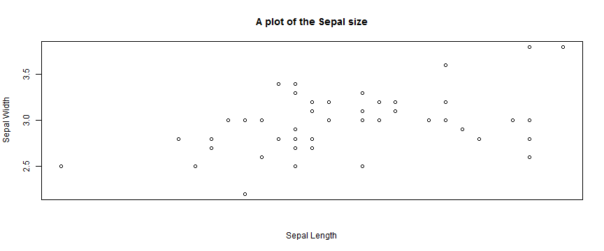
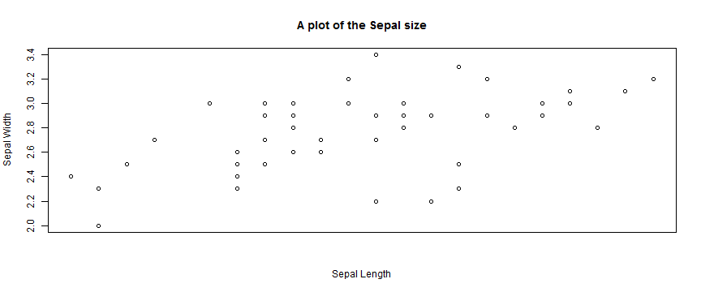
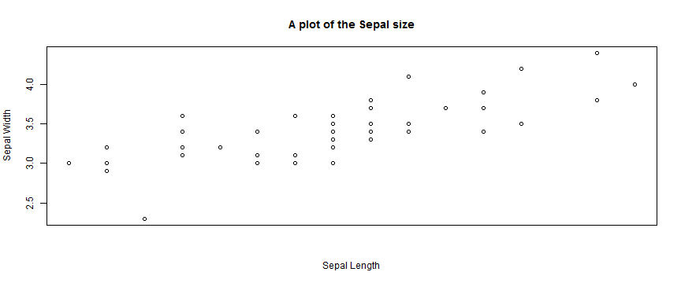

## Course Project: Shiny Application and Reproducible Pitch

Different Species have different sepal sizes, and they seem to have a linear pattern between them.
if you load the iris dataset


```r
data(iris)
irisdataset <- iris
```

---
## Plot 1
### A plot of the Specie Virginica

```r
plant <- "virginica"
data <- subset(irisdataset, iris$Species == plant)   
 
plot(data$Sepal.Length, data$Sepal.Width, main = "A plot of the Sepal size", xlab = "Sepal Length", ylab = "Sepal Width",  xaxt="n")
```

 

---
## Plot 2
### A plot of the Specie Versicolor

```r
plant <- "versicolor"
data <- subset(irisdataset, iris$Species == plant)   

plot(data$Sepal.Length, data$Sepal.Width, main = "A plot of the Sepal size", xlab = "Sepal Length", ylab = "Sepal Width",  xaxt="n")
```

 


---
## Plot 3
### A plot of the Specie Setosa

```r
plant <- "setosa"
data <- subset(irisdataset, iris$Species == plant)   

plot(data$Sepal.Length, data$Sepal.Width, main = "A plot of the Sepal size", xlab = "Sepal Length", ylab = "Sepal Width",  xaxt="n")
```

 


