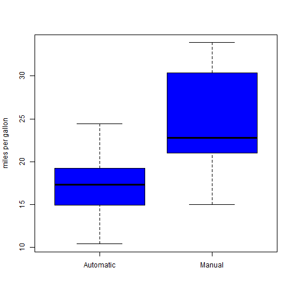

Regression Models Course Project
========================================================

### Context

You work for Motor Trend, a magazine about the automobile industry. Looking at a data set of a collection of cars, they are interested in exploring the relationship between a set of variables and miles per gallon (MPG) (outcome). They are particularly interested in the following two questions:

- "Is an automatic or manual transmission better for MPG"
- "Quantifying how different is the MPG between automatic and manual transmissions?"

### Question

Take the mtcars data set and write up an analysis to answer their question using regression models and exploratory data analyses.

Your report must be:

Written as a PDF printout of a compiled (using knitr) R markdown document.
Do not use any packages that are not in R-base or the library datasets.
Brief. Roughly the equivalent of 2 pages or less for the main text. Supporting figures in an appendix can be included up to 5 total pages including the 2 for the main report. The appendix can only include figures.
Include a first paragraph executive summary.


### Load the data


```r
data(mtcars)
```

### Exploratory analysis


```r
#Results omited for not having enought space and not needed.
summary(mtcars)
```


```r
mtcars$cyl <- factor(mtcars$cyl)
mtcars$vs <- factor(mtcars$vs)
mtcars$gear <- factor(mtcars$gear)
mtcars$carb <- factor(mtcars$carb)
mtcars$am <- factor(mtcars$am,labels=c('Automatic','Manual'))

#Result shown in the Appendix
summary(mtcars)
```


### Regression model

```r
full.model <- lm(mpg ~ ., data = mtcars)
best.model <- step(full.model, direction = "backward")
```


```r
#Result shown in the Appendix
summary(best.model)
```

- This procedure determines that the best model includes the cyl6, cyl8, hp, wt, and amManual variables (overall p-value<0.001). The adjusted R-squared indicates that about 84% of the variance is explained by the final model. Moreover, the output of this model suggests that mpg decreases with respect to cylinders (-3.03 and -2.16 for cyl6 and cyl8, respectively), horsepower (-0.03), and weight (for every 1,000lb, by -2.5). On the other hand, mpg increases with respect to having a manual transmission (by 1.8). Residual plots (see appendix) suggest that some transformation may be necessary to achieve linearity.


```r
t.test(mpg ~ am, data = mtcars)
```

```
## 
## 	Welch Two Sample t-test
## 
## data:  mpg by am
## t = -3.767, df = 18.33, p-value = 0.001374
## alternative hypothesis: true difference in means is not equal to 0
## 95 percent confidence interval:
##  -11.28  -3.21
## sample estimates:
## mean in group Automatic    mean in group Manual 
##                   17.15                   24.39
```


```r
#Result shown in the Appendix
boxplot(mpg ~ am, data = mtcars, col = "blue", ylab = "miles per gallon")
```

- The boxplots show a difference in mpg depending on the type of transmission. The t-test output confirms that this difference is statistically significant (p-value < 0.05).


### Conclusion

According to these results, cars with a manual transmission are better for mpg than cars with an automatic transmission. The rate of change of the conditional mean mpg with respect to am is about 1.8, and we are 95% confident that this value varies between -1.06 and 4.68. There are however some limitations to this study. To name a few:

 <br /> 
  <br /> 


### Appendix

**Exploratory analysis**


```r
summary(mtcars)
```

```
##       mpg       cyl         disp             hp             drat     
##  Min.   :10.4   4:11   Min.   : 71.1   Min.   : 52.0   Min.   :2.76  
##  1st Qu.:15.4   6: 7   1st Qu.:120.8   1st Qu.: 96.5   1st Qu.:3.08  
##  Median :19.2   8:14   Median :196.3   Median :123.0   Median :3.69  
##  Mean   :20.1          Mean   :230.7   Mean   :146.7   Mean   :3.60  
##  3rd Qu.:22.8          3rd Qu.:326.0   3rd Qu.:180.0   3rd Qu.:3.92  
##  Max.   :33.9          Max.   :472.0   Max.   :335.0   Max.   :4.93  
##        wt            qsec      vs             am     gear   carb  
##  Min.   :1.51   Min.   :14.5   0:18   Automatic:19   3:15   1: 7  
##  1st Qu.:2.58   1st Qu.:16.9   1:14   Manual   :13   4:12   2:10  
##  Median :3.33   Median :17.7                         5: 5   3: 3  
##  Mean   :3.22   Mean   :17.8                                4:10  
##  3rd Qu.:3.61   3rd Qu.:18.9                                6: 1  
##  Max.   :5.42   Max.   :22.9                                8: 1
```

**Regression model**

```r
summary(best.model)
```

```
## 
## Call:
## lm(formula = mpg ~ cyl + hp + wt + am, data = mtcars)
## 
## Residuals:
##    Min     1Q Median     3Q    Max 
## -3.939 -1.256 -0.401  1.125  5.051 
## 
## Coefficients:
##             Estimate Std. Error t value Pr(>|t|)    
## (Intercept)  33.7083     2.6049   12.94  7.7e-13 ***
## cyl6         -3.0313     1.4073   -2.15   0.0407 *  
## cyl8         -2.1637     2.2843   -0.95   0.3523    
## hp           -0.0321     0.0137   -2.35   0.0269 *  
## wt           -2.4968     0.8856   -2.82   0.0091 ** 
## amManual      1.8092     1.3963    1.30   0.2065    
## ---
## Signif. codes:  0 '***' 0.001 '**' 0.01 '*' 0.05 '.' 0.1 ' ' 1
## 
## Residual standard error: 2.41 on 26 degrees of freedom
## Multiple R-squared:  0.866,	Adjusted R-squared:  0.84 
## F-statistic: 33.6 on 5 and 26 DF,  p-value: 1.51e-10
```

```r
boxplot(mpg ~ am, data = mtcars, col = "blue", ylab = "miles per gallon")
```

 

```r
par(mfrow=c(2, 2))
plot(best.model)
```

 
