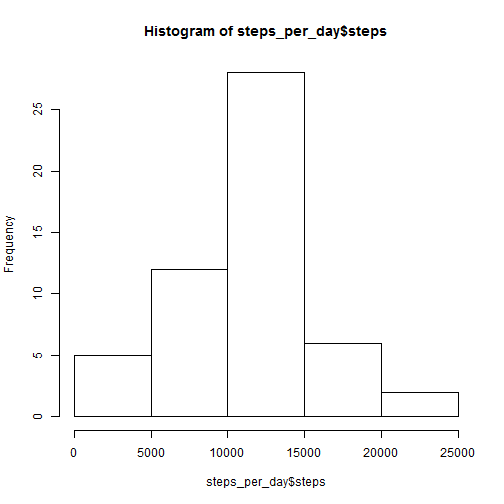
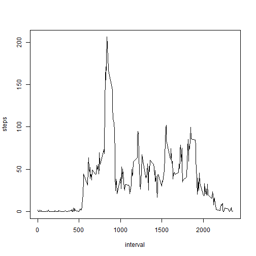
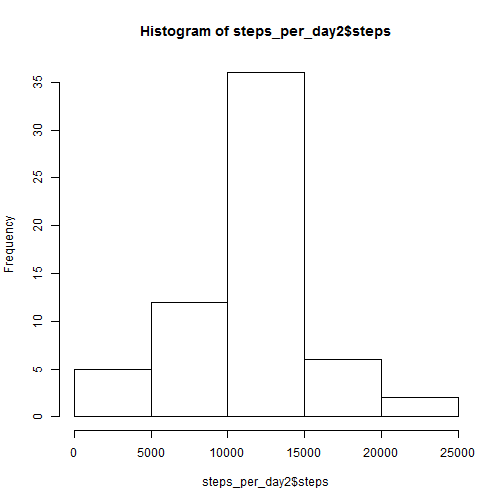
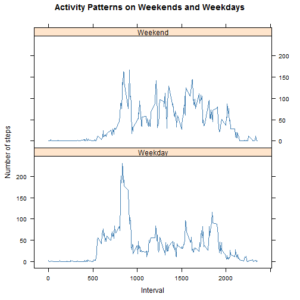

Peer Assessment 1
=================

This is an R Markdown document for the class Reproducible Research, Peer Assessment 1. By Rodrigo B. de Alexandre 

## Loading and preprocessing the data

```r
ds <- read.csv("activity.csv")
ds$date <- as.Date(ds$date, "%Y-%m-%d")
steps_per_day <- aggregate(steps ~ date, data = ds, sum, na.rm = TRUE)
steps_per_interval <- aggregate(steps ~ interval, data = ds, mean, na.rm = TRUE)
missing <- !complete.cases(ds)
```


Histogram of the total number of steps take each day:

```r
hist(steps_per_day$steps)
```

 


## What is mean total number of steps taken per day?

```r
summary(steps_per_day$steps)
```

```
##    Min. 1st Qu.  Median    Mean 3rd Qu.    Max. 
##      41    8840   10800   10800   13300   21200
```


## What is the average daily activity pattern?

```r

plot(steps ~ interval, data = steps_per_interval, type = "l")
```

 


## Imputing missing values

```r
# Calculate and report the total number of missing values in the dataset
# (i.e. the total number of rows with NAs)
sum(missing == TRUE)
```

```
## [1] 2304
```

```r

# Devise a strategy for filling in all of the missing values in the dataset.
# The strategy does not need to be sophisticated. For example, you could use
# the mean/median for that day, or the mean for that 5-minute interval, etc.
ds2 <- ds[missing == TRUE, ]
ds2[, 1] <- steps_per_interval$step

# Create a new dataset that is equal to the original dataset but with the
# missing data filled in
ds_filled_na <- rbind(ds[complete.cases(ds), ], ds2)

# Make a histogram of the total number of steps taken each day and Calculate
# and report the mean and median total number of steps taken per day. Do
# these values differ from the estimates from the first part of the
# assignment? What is the impact of imputing missing data on the estimates
# of the total daily number of steps?
steps_per_day2 <- aggregate(steps ~ date, data = ds_filled_na, sum)
hist(steps_per_day2$steps)
```

 

```r

summary(steps_per_day2$steps)
```

```
##    Min. 1st Qu.  Median    Mean 3rd Qu.    Max. 
##      41    9820   10800   10800   12800   21200
```


## Are there differences in activity patterns between weekdays and weekends?

```r
weekdays <- weekdays(ds_filled_na$date)
ds_filled_na$weekdays <- ifelse(weekdays == "domingo" | weekdays == "sábado", 
    "Weekend", "Weekday")

steps_per_week <- aggregate(ds_filled_na$steps, by = list(ds_filled_na$interval, 
    ds_filled_na$weekdays), mean)

names(steps_per_week) <- c("interval", "weekdays", "steps")
library(lattice)
xyplot(steps ~ interval | weekdays, steps_per_week, type = "l", layout = c(1, 
    2), xlab = "Interval", ylab = "Number of steps", main = "Activity Patterns on Weekends and Weekdays", 
    col = "steelblue")
```

 

