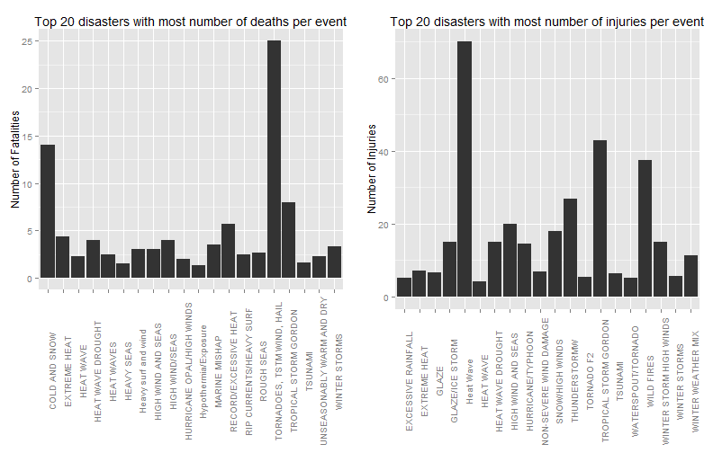
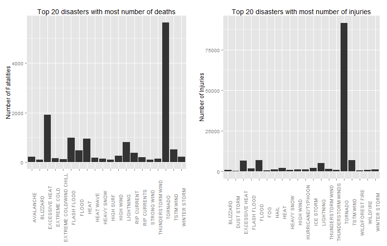
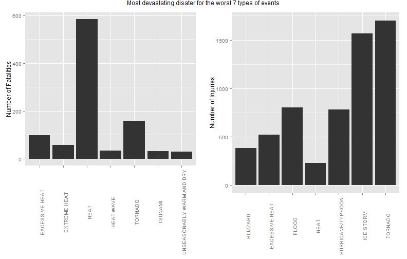

Weather events impact in United States injuries and deaths (1950-2011) 
========================================================

## Synopsis
This data come from the U.S. National Oceanic and Atmospheric Administration's (NOAA) storm database. The objective was to analyze the effects of different types of natural disasters over the outcomes (fatalities and injuries) related to the people of the U.S.

### Data Processing
This database is stored as a comma-separated-value file compressed via the bzip2 algorithm to reduce its size. You can download the file from this link: [Storm Data 47Mb](https://d396qusza40orc.cloudfront.net/repdata%2Fdata%2FStormData.csv.bz2)

You can read the file by extracting into you working directory and using the function read.csv.
I strongly recommend that you format the column BGN_DATE with the functions as.POSIXlt for any further investigation related to month/year of this data. However it is not needed for this short analysis.
The graphics of this work are based on the ggplot2 codes. So for proper working use the library function to load ggplot2 before the analysis.


```r
StormData <- read.csv("repdata-data-StormData.csv")
df <- within(StormData, datetime <- as.POSIXlt(BGN_DATE, format = "%m/%d/%Y"))
library(ggplot2)
require(gridExtra)
```

```
## Loading required package: gridExtra
## Loading required package: grid
```


A few tables ware constructed. The first table, called type, was intend to check the number of different disasters and its frequency. This same result can be seen by the use of the function summary, however, this table will be used for later propose. With the use of this last function, we can also see the mean fatalities and injuries, and the most common state to have natural disasters.
The use of the function str shows us that there are 985 different natural disasters.


```r
type <- data.frame(table(StormData$EVTYPE))
summary(df[, c(7, 8, 23, 24)], 10)
```

```
##      STATE                       EVTYPE         FATALITIES 
##  TX     : 83728   HAIL              :288661   Min.   :  0  
##  KS     : 53440   TSTM WIND         :219940   1st Qu.:  0  
##  OK     : 46802   THUNDERSTORM WIND : 82563   Median :  0  
##  MO     : 35648   TORNADO           : 60652   Mean   :  0  
##  IA     : 31069   FLASH FLOOD       : 54277   3rd Qu.:  0  
##  NE     : 30271   FLOOD             : 25326   Max.   :583  
##  IL     : 28488   THUNDERSTORM WINDS: 20843                
##  AR     : 27102   HIGH WIND         : 20212                
##  NC     : 25351   LIGHTNING         : 15754                
##  (Other):540398   (Other)           :114069                
##     INJURIES     
##  Min.   :   0.0  
##  1st Qu.:   0.0  
##  Median :   0.0  
##  Mean   :   0.2  
##  3rd Qu.:   0.0  
##  Max.   :1700.0  
##                  
##                  
##                  
## 
```

```r
str(type)
```

```
## 'data.frame':	985 obs. of  2 variables:
##  $ Var1: Factor w/ 985 levels "   HIGH SURF ADVISORY",..: 1 2 3 4 5 6 7 8 9 10 ...
##  $ Freq: int  1 1 1 1 4 1 1 1 1 4 ...
```


Other tables were made to sum the number of injuries or deaths for each type of disasters.
Though the column bind function, these sums were attach to the "type" table. From this combined table it was possible to check the mean values of fatalities and injuries for each type of disaster. These tables were ordered by most frequent.
A table of the separated number of outcomes order by the most "chaotic" was also created.


```r

dffatsum <- aggregate(FATALITIES ~ EVTYPE, data = df, sum, na.action = na.omit)
dfinjsum <- aggregate(INJURIES ~ EVTYPE, data = df, sum, na.action = na.omit)

dffs <- cbind(type, dffatsum$FATALITIES, dfinjsum$INJURIES)
colnames(dffs) <- c("EVTYPE", "FREQ", "FATALITIES", "INJURIES")
dffs$FATMEAN <- dffs$FATALITIES/dffs$FREQ
dffs$INJMEAN <- dffs$INJURIES/dffs$FREQ

FATALITIES <- head(dffs[order(dffs$FATALITIES, decreasing = TRUE), ], 20)[, 
    c(1, 3)]
INJURIES <- head(dffs[order(dffs$INJURIES, decreasing = TRUE), ], 20)[, c(1, 
    4)]

FATMEAN <- head(dffs[order(dffs$FATMEAN, decreasing = TRUE), ], 20)[, c(1, 5)]
INJMEAN <- head(dffs[order(dffs$INJMEAN, decreasing = TRUE), ], 20)[, c(1, 6)]

dffat <- head(df[order(df$FATALITIES, decreasing = TRUE), ], 40)[, c(8, 23)]
dfinj <- head(df[order(df$INJURIES, decreasing = TRUE), ], 70)[, c(8, 24)]
```


### Results
For exception of tornados, it is possible to see that the most 10 frequent catastrophe are not as well the most responsible for the highest number of outcomes related to people.
Bellow it's possible to show the 10 most frequent disasters:


```r
head(dffs[order(dffs$FREQ, decreasing = TRUE), ], 10)
```

```
##                 EVTYPE   FREQ FATALITIES INJURIES   FATMEAN  INJMEAN
## 244               HAIL 288661         15     1361 5.196e-05 0.004715
## 856          TSTM WIND 219940        504     6957 2.292e-03 0.031631
## 760  THUNDERSTORM WIND  82563        133     1488 1.611e-03 0.018023
## 834            TORNADO  60652       5633    91346 9.287e-02 1.506067
## 153        FLASH FLOOD  54277        978     1777 1.802e-02 0.032739
## 170              FLOOD  25326        470     6789 1.856e-02 0.268064
## 786 THUNDERSTORM WINDS  20843         64      908 3.071e-03 0.043564
## 359          HIGH WIND  20212        248     1137 1.227e-02 0.056254
## 464          LIGHTNING  15754        816     5230 5.180e-02 0.331979
## 310         HEAVY SNOW  15708        127     1021 8.085e-03 0.064999
```


In addition, due to the relationship of frequency of events, the disasters with the highest number of incidents doesn't have the highest mean (outcome/ disaster frequency). These numbers shows us that the average number of deaths and injuries doesn't represent a valid analysis, since the mean is highest to rare events. However, this brings the knowledge that people are less prepared to these events, therefore, they bring higher risks of incidents.

```r
head(dffs[order(dffs$FATMEAN, decreasing = TRUE), ], 10)
```

```
##                         EVTYPE FREQ FATALITIES INJURIES FATMEAN INJMEAN
## 842 TORNADOES, TSTM WIND, HAIL    1         25        0  25.000   0.000
## 72               COLD AND SNOW    1         14        0  14.000   0.000
## 851      TROPICAL STORM GORDON    1          8       43   8.000  43.000
## 580      RECORD/EXCESSIVE HEAT    3         17        0   5.667   0.000
## 142               EXTREME HEAT   22         96      155   4.364   7.045
## 279          HEAT WAVE DROUGHT    1          4       15   4.000  15.000
## 373             HIGH WIND/SEAS    1          4        0   4.000   0.000
## 487              MARINE MISHAP    2          7        5   3.500   2.500
## 976              WINTER STORMS    3         10       17   3.333   5.667
## 340        Heavy surf and wind    1          3        0   3.000   0.000
```

```r
head(dffs[order(dffs$INJMEAN, decreasing = TRUE), ], 10)
```

```
##                      EVTYPE FREQ FATALITIES INJURIES FATMEAN INJMEAN
## 277               Heat Wave    1          0       70  0.0000   70.00
## 851   TROPICAL STORM GORDON    1          8       43  8.0000   43.00
## 954              WILD FIRES    4          3      150  0.7500   37.50
## 821           THUNDERSTORMW    1          0       27  0.0000   27.00
## 366      HIGH WIND AND SEAS    1          3       20  3.0000   20.00
## 656         SNOW/HIGH WINDS    2          0       36  0.0000   18.00
## 224         GLAZE/ICE STORM    1          0       15  0.0000   15.00
## 279       HEAT WAVE DROUGHT    1          4       15  4.0000   15.00
## 973 WINTER STORM HIGH WINDS    1          1       15  1.0000   15.00
## 411       HURRICANE/TYPHOON   88         64     1275  0.7273   14.49
```

A graphical interpretation of the 20 events with highest average:

```r
plot3 <- ggplot(FATMEAN, aes(as.character(EVTYPE), FATMEAN)) + geom_bar(stat = "identity", 
    position = "dodge") + theme(axis.text.x = element_text(angle = 90)) + labs(title = "Top 20 disasters with most number of deaths per event", 
    x = NULL, y = "Number of Fatalities")
plot4 <- ggplot(INJMEAN, aes(as.character(EVTYPE), INJMEAN)) + geom_bar(stat = "identity", 
    position = "dodge") + theme(axis.text.x = element_text(angle = 90)) + labs(title = "Top 20 disasters with most number of injuries per event", 
    x = NULL, y = "Number of Injuries")
grid.arrange(plot3, plot4, ncol = 2)
```

 


Furthermore, to better interpretation of this data, an analysis of the sum of outcomes can be better analyzed with a graphical view. This graphic shows that tornados are the biggest responsible for injuries and fatalities even though its average is low.

```r
plot1 <- ggplot(FATALITIES, aes(as.character(EVTYPE), FATALITIES)) + geom_bar(stat = "identity", 
    position = "dodge") + theme(axis.text.x = element_text(angle = 90)) + labs(title = "Top 20 disasters with most number of deaths", 
    x = NULL, y = "Number of Fatalities")
plot2 <- ggplot(INJURIES, aes(as.character(EVTYPE), INJURIES)) + geom_bar(stat = "identity", 
    position = "dodge") + theme(axis.text.x = element_text(angle = 90)) + labs(title = "Top 20 disasters with most number of injuries", 
    x = NULL, y = "Number of Injuries")
grid.arrange(plot1, plot2, ncol = 2)
```

 

```r

subset(dffs, dffs$EVTYPE == "TORNADO")
```

```
##      EVTYPE  FREQ FATALITIES INJURIES FATMEAN INJMEAN
## 834 TORNADO 60652       5633    91346 0.09287   1.506
```


In the next graphic, it's possible to show the 7 worst and most devastating event of each disasters.
By this graphic we can see that, even though tornados are the most frequent cause of deaths and injuries overall, excessive heat, extreme heat and heat, when happens, have the highest impact in numbers of fatalities.


```r
plot5 <- ggplot(dffat, aes(as.character(EVTYPE), FATALITIES)) + geom_bar(stat = "identity", 
    position = "dodge") + theme(axis.text.x = element_text(angle = 90)) + labs(title = NULL, 
    x = NULL, y = "Number of Fatalities")
plot6 <- ggplot(dfinj, aes(as.character(EVTYPE), INJURIES)) + geom_bar(stat = "identity", 
    position = "dodge") + theme(axis.text.x = element_text(angle = 90)) + labs(title = NULL, 
    x = NULL, y = "Number of Injuries")
grid.arrange(plot5, plot6, ncol = 2, main = "Most devastating disater for the worst 7 types of events")
```

 


